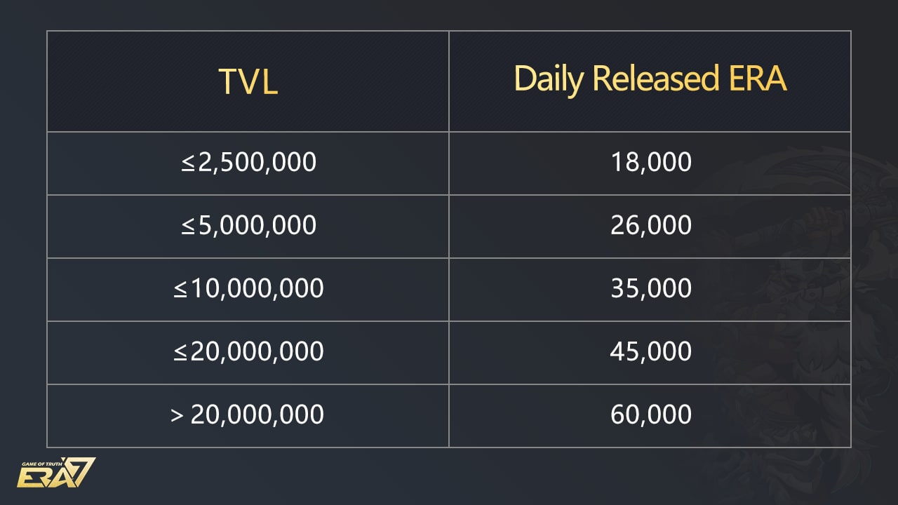
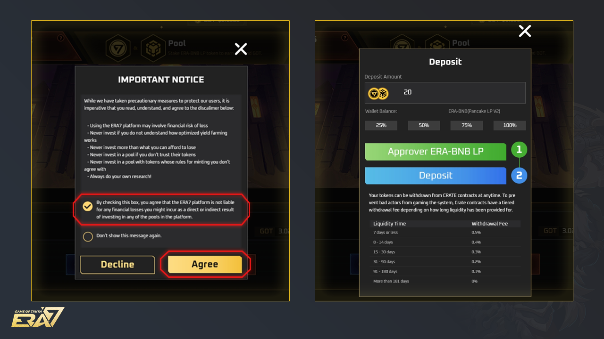
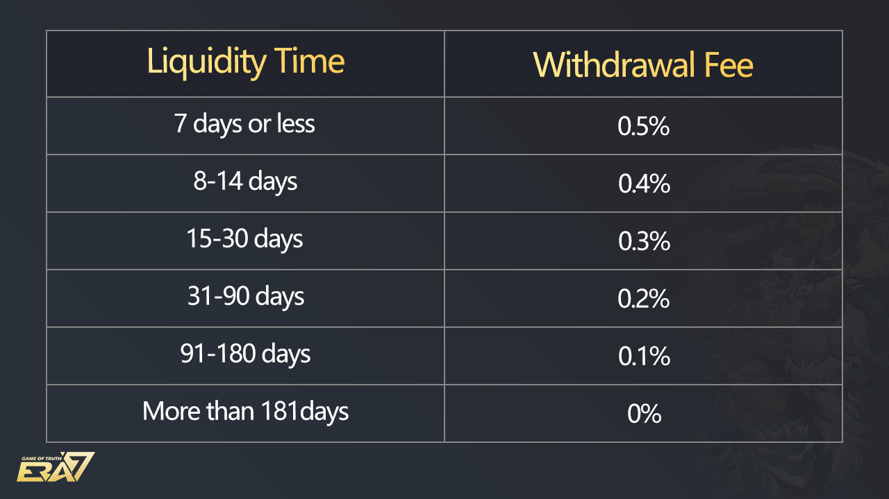

# Era7 Farm

## **Introduction**

Era7 Farm allow you to earn  ERA Token by staking ERA-BNB LP tokens. To obtain ERA-BNB LP Tokens, you need to provide liquidity to ERA-BNB pool on PancakeSwap. Based on the number of ERA Token and BNB that you add into the pool, representing your share in the asset of the liquidity pool, you receive the corresponding amount of LP Tokens.

Please note that your ERA-BNB LP Tokens can only be staked in either Era7 Farm or the ERA-BNB Farm on PancakeSwap. You won’t be rewarded by staking ERA-BNB LP tokens in both Farms.

## **Daily Rewards Distribution**

1\.     ERA Token

The number of ERA Tokens distributed daily to Era7 Farm users is determined by ERA Token TVL. (Total Value Locked), and the daily distribution is updated at 00:00 UTC every day.

2\. APR (Annual Percentage Rate)

ERA-BNB LP Token APR is calculated according to the total amount of staked tokens and daily rewards. The data is updated in real-time.

3\. Claim Your Rewards

The GOT and ERA Token that you earned in Era7 Farm are updated in real-time. You can claim your rewards at any time

## **How to Use Era7 Farm?**

1\. Swap

Click on \[Swap] to swap tokens on PancakeSwap [https://pancakeswap.finance/swap](https://pancakeswap.finance/swap).

While swapping tokens, please ensure: the two tokens you want to swap. By choosing the trading pair, you can also check the tokens LIVE chart for the current exchange rate.

Type the confirmed swap amount and click on \[Swap] to confirm the token swap.

2.Liquidity

Click on \[Liquidity] to provide liquidity to ERA-BNB pool on PancakeSwap [https://pancakeswap.finance/add](https://pancakeswap.finance/add)

Please note that the token you add to the liquidity must be BNB and ERA Token.

Enter the amount of ERA Token and BNB that you want to provide into the pool. If you don’t have enough ERA Tokens or BNB, you can go to the Swap page to do token exchange.

Finally, click on \[Supply] to complete the liquidity providing and get your ERA-BNB LP Tokens.

Go back to Era7 Farm to make the deposit with your ERA-BNB LP Tokens

3.Deposit

After obtaining ERA-BNB LP Tokens from PancakeSwap, return to Era7 Farm and click on \[Deposit].

Please read the important notice carefully. If you agree with the rules, tick the first checkbox then click on \[Agree]; if you don’t agree with the rules, please click on \[Decline].

By clicking on \[Agree], you can either type the amount of ERA-BNB LP Token or choose the percentage of LP Token that you want to stake.

Finally, clicking on \[Deposit] to confirm the transaction and complete the process.

4\. Withdraw

&#x20;You can remove your staked ERA-BNB LP Tokens from the CRATE contract at any time by clicking on \[Withdraw]. To prevent bad actors from gaming the system, Crate contracts have a tiered withdrawal fee depending on how long your liquidity has been provided.

Enter the amount or choose the percentage of staked EAR-BNB LP Token to remove from Era7 Farm.

&#x20;Click on \[Withdraw] and confirm the transaction via the notification of your crypto wallet.
