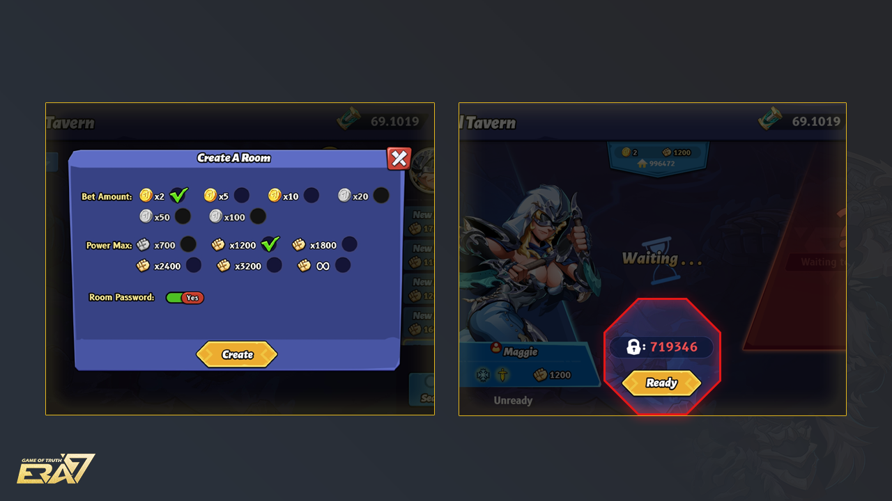
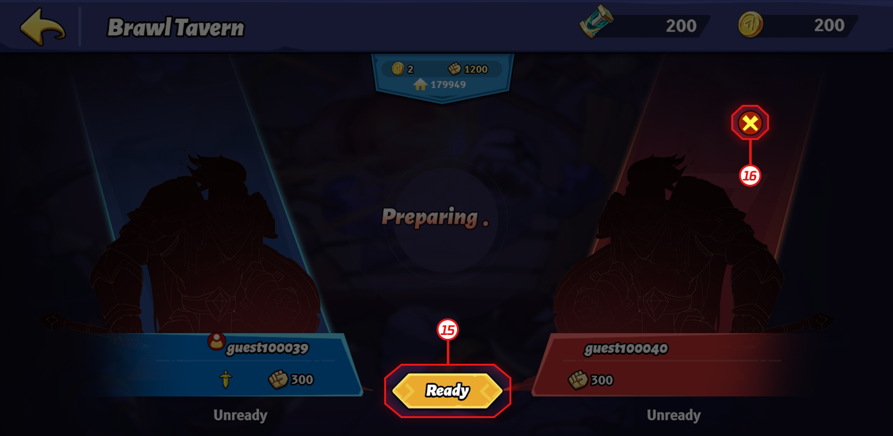

# Brawl Tavern

## Brawl Tavern is a PvP mode that allows you to customize the battle room.

You can unlock it when you reach Lv. 6 in Quick Match. You can either create your own room or join a room created by another player, having a 1v1 battle. The winner gets double the Bet Amount, calculated by deducting a 5% of Battle Tax, while the Loser loses their Bet amount. Meanwhile, Lucky Bonus and Lucky Jackpot are generated randomly and waiting for you.

## Introduction

1\.    \[ ? ]: Brawl Tavern Rules

2\.    Filter Menu – \[Bet Amount]

There are six different sizes of reward: ERA×2, ERA×5, ERA×10, ERA×20, ERA×50, and ERA×100.

3\.    Filter Menu – \[Combat Power] (the total Combat Power of Battle Cards and Master Card)

There are 5 levels: ≤1200, ≤1800, ≤2400, ≤3200, and ∞.

4\.    Available Room: Tick on this checkbox, the battle rooms in the Tavern lobby will be filtered by \[Bet Amount] and \[Combat Power], and only the rooms that can be joined will be displayed.

5\.    \[Reset]: Click on \[Reset] to reset all filters.

6\.    Room Status: Waiting, Battling, or Full.

7\.    Avatar

Before the battle starts, every player’s profile only shows the default avatar, Rookie; after the battle starts, the NFT Master Cards that the players set as their avatars will appear.

8\.    Room Number

9\.    \[Join]:

To enter the battle room, you need to meet the matching requirements of the room, including holding enough Game ERA Token to place a bet and the Combat Power of your deck being in the same range of level.

10\.  Lucky Jackpot:\
The winner gets an additional bonus equivalent to 100％ of the bet amount based on the six different reward sizes. (The Lucky Jackpot icon will show up after the battle starts, on the loading page, and during the battle)

**How to Calculate the battle rewards in the Lucky Jackpot Room?**\
For example, if the requirement of the bet amount in this Lucky Jackpot Room happened to be ERA×100, the winner gets:\
(100＋100) × 0.95 \[i]＋ (100 × 1) ＝ 290 ERA Token\
\*the underline is the bonus from the Lucky Jackpot Room.

11\.  Lucky Bonus:

The winner gets an additional bonus equivalent to 30% of the bet amount based on the six different reward sizes. (The Lucky Bonus icon will show up after the battle starts, on the loading page, and during the battle)\
**How to Calculate the battle rewards in the Lucky Bonus Room?**\
\*For example, if the requirement of the bet amount in this Lucky Bonus Room happened to be ERA×5, the winner gets:\
(5＋5) × 0.95 ＋ (5 × 0.3) ＝ 11 ERA Token\
\*the underline is the bonus from the Lucky Bonus Room.

12\.  The Combat Power of your chosen deck.

The Calculation Rule of Combat Power:

13\.  \[Search]

a.    Enter the Room Number and search for the corresponding room.

b.    You will be asked for a Room Password if it is an encrypted room.

14\.  \[Create]

a.    Create your own room by customizing the match settings based on your own requirement: the size of the Bet Amount and the maximum Combat Power of the deck. The selections that you fail to meet their requirements will be greyed out.

b.    Switch on to allow the system to generate a random Room Password for your private room.

15\.  \[Ready]:

a.    Click on \[Ready] when you are ready to start the battle.

b.    The battle begins when both players are ready.

16\.  \[Remove]: Only the host can remove the player from the room.

17\.  \[Lucky Room]: The Lucky Room icon will show up after the battle, on the loading page, and during the battle.

18\.  Battle Rewards: The winner gets double the Bet Amount, calculated by deducting a 5% of Battle Tax, while the loser loses their Bet Amount. If you are lucky enough to battle in a Lucky Bonus Room or Lucky Jackpot Room generated randomly, the winner will be rewarded with a surprise bonus!

19\.  Battle tax: A 5% battle tax is charged when settling the winner's rewards in each round. Taxes charged will be used for:

a.    1% = Burning ERA Tokens

b.    1% = Reserved in the Era7 Treasury

c.     3% = Adding into the Lucky Bonus Pool
