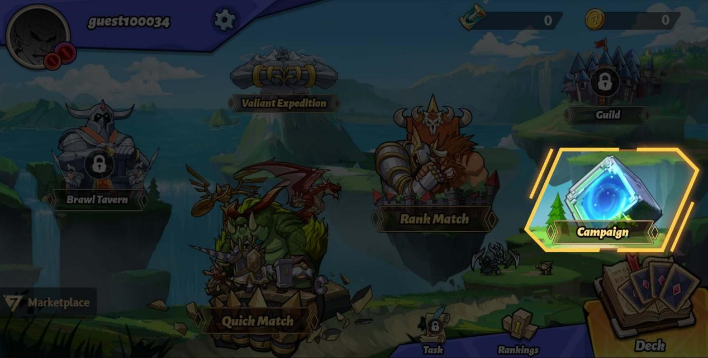
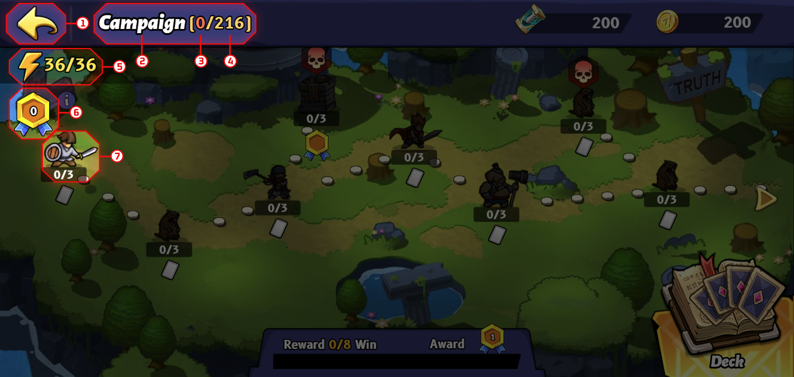
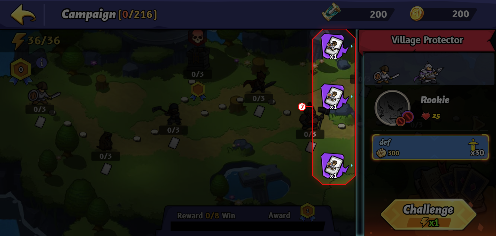
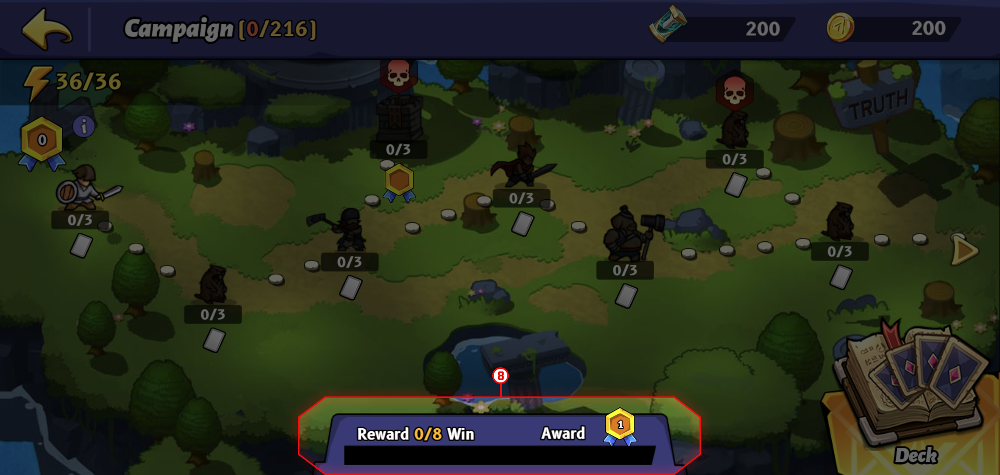

# Campaign

* The campaign is the second PvE mode in Era7. You can unlock it when you reach Lv. 3 in Quick Match. There are 216 battles in a total of 72 stages, which also means that there are three battles and three rewards in each stage. The rewards in the Campaign include non-NFT Battle Cards, GOT, medals, etc.

*   Campaign Introduction:

    1. Back Button: Click on \[Back Button] and go back to the game lobby.
    2. The campaign, name of the mode.
    3. The number of battles that you’ve won.
    4. The total number of battles you can challenge to earn rewards. Every stage contains three battles. There is a total of 72 stages and 216 battles in \[Campaign].
    5.  Vitality Point:

        a.    The maximum Vitality Point is 36. When you first enter Campaign, your Vitality Point is full.

        b.    The Vitality Point recovers every two hours.
    6. Medal: By earning a medal, it will increase 1% of GOT that you earn in \[Valiant Expedition].
    7.  Battle/Stage

        How to unlock stages?

        Every stage is represented by a Battle Card character as the stage avatar. One stage includes three battles. You need to win at least one battle in a stage to unlock the next stage.

        a.    Three statuses of the stage:

        \-Locked: A locked stage shows a dim icon.

        \-Unlocked: On the completion of one battle from the previous stage, the next stage becomes unlocked, and it shows a bright icon.

        \-Cleared: After winning all three battles in one stage, the stage is now cleared/completed. You can always come back and challenge the same battles without consuming Vitality Point, but you will not be able to earn the rewards again.
    8.  Rewards

        a.    Every stage provides its own three rewards, including but not limited to non-NFT Battle Cards, GOT, and medals.

        b.    When you complete a certain number of battles, you will be awarded special rewards.

        c.    You can only earn the reward from each battle once. You will not be rewarded for challenging the completed stages.

