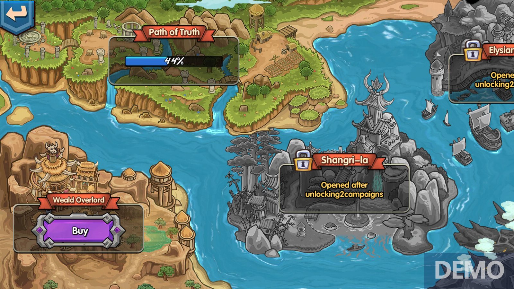

# Continent

* In the future, across the vast expanse that is the Era7 metaverse, players will encounter an endless amount of land upon which they will be able to build and operate their own homes. Players can use various resources and processing materials found in the game to upgrade their own lands. In addition, the owner of a plot of land can find his or her location on the world map. Using the Era7 cards in his or her home to explore the world map can also be a good way of obtaining Era tokens.
* Players also have a certain probability of obtaining Era tokens through the land itself.
* This is a unique feature of The Game of Truth, and sets the game apart from similar platforms within GameFi; players have land development rights while landowners will receive abundant resources and subsidies. This is the working direction that the project party shall focus on in the future.

