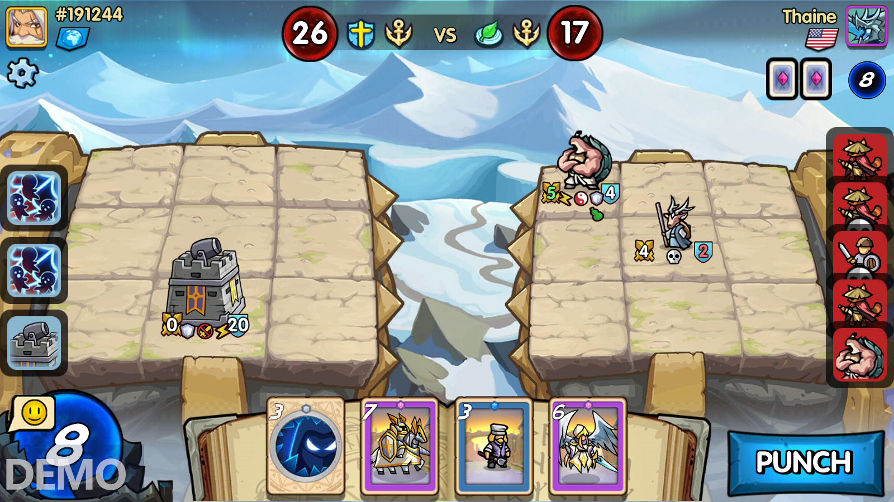
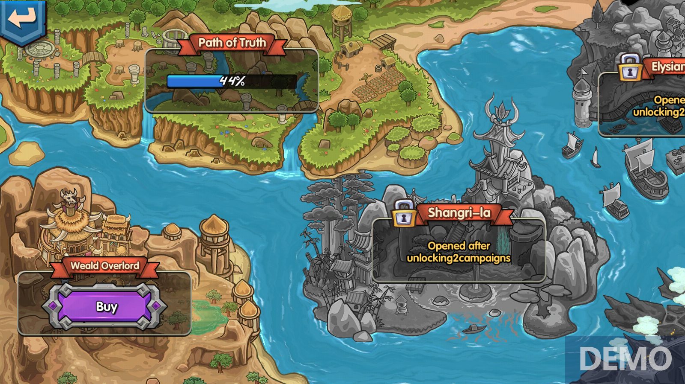
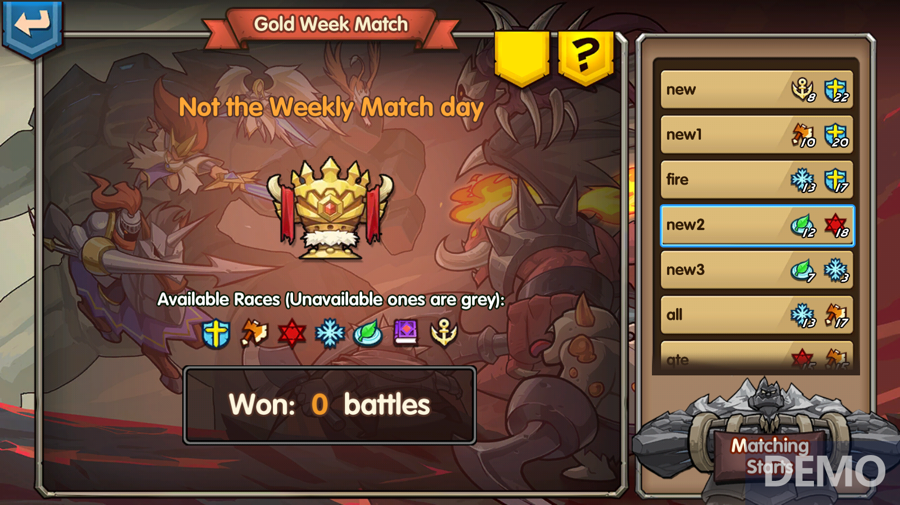

# Fighting gameplay

## Fighting

* The Game of Truth is played on a battlefield made up of 9 \* 9 squares on both sides. First of all, both sides will randomly draw cards from their pre-built 30-card library. The player will then be able to drag out cards to use in-game. Battle cards will then attack and defend with the passing of each round, while some cards will have characteristic effects that transcend rounds. The battlefield is divided into three fronts. If there are no cards on the opponent's first front, attributing damage will be caused to the cards on the player's second front, and so on. When the opponent's HP drops to 0, victory is attained. Conversely, if your HP drops to 0, you’ve lost the battle.&#x20;
* The core essentials of combat are: to establish battlefield advantages and powerful card groups; to play games with opponents through thought-out strategy making.

## PVE Player & Environment

* Throughout Era7 PVE mode. Players need at least 30 battle cards to fight and face a variety of rich challenges. When the player passes a level, GOT (similar to Axie's SLP, this can be used to summon battle cards from the master card) can be obtained. Players can also repeat the challenge daily to obtain corresponding rewards in the form of resources.
* The PVE of Era7 includes at least 50 levels, 8 campaigns, more than 3,000 stages and a variety of challenges. We’ll continue to update PVE levels in subsequent versions of the game.

## PVP Player\&Player

* In the Era7 metaverse, when a player enters the PVP arena, he or she shall be matched with other players. The player will then have the chance to win Era7 tokens and/or GOT after winning the battle. Players with higher rankings can get more rewards from the game. In addition, Era tokens and GOT can be sold or exchanged via the marketplace, so that players can profit from them in real life.
* PVP has a variety of battles:
* Expert Alliance (daily)
* Ranked competitions(monthly)
* World Cups (fortnightly)
* In PVP, if the player wins, he or she will receive GOT or Era tokens with PVP rankings. Similarly, a higher ranking will then allow players to get more GOT and Era tokens through PVP. We will settle the reward on a daily and on a monthly basis. Remember, GOT and Era tokens can be traded on the market so that players can profit from them in real life.

