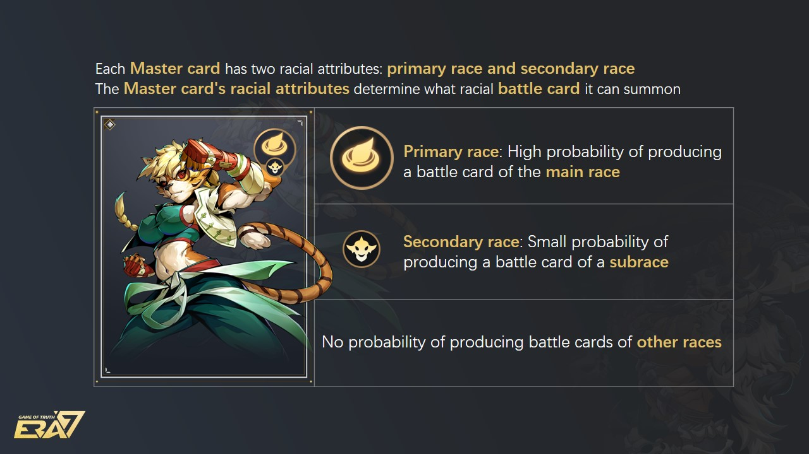
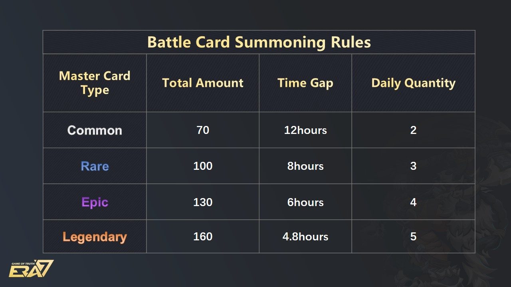

# Summoning

## **NFT Master Card’s Unsealing & Summoning System**

* To obtain NFT Master Cards, players need to buy mystery boxes directly or trade with other players in the Marketplace. NFT Master Cards do not participate in the battles themselves, they Summon NFT Battle Cards which actually make up the deck to fight on the front lines. After successfully purchasing NFT Master Cards, players will need to Unseal them first before they can Summon NFT Battle Cards. If the NFT Master Cards have reached the maximum amount of Summoning, the players will need to consume ERA and GOT tokens as fuel so that they can continue Summoning.

.png>)

* Unsealing: Every NFT Master Card can only be unsealed once. NFT Master Cards need to be unsealed before they can Summon NFT Battle Cards. Once the player Unseals the NFT Master Card, the system will give it a one-off, 10 extra opportunities to Summon extra NFT Battle Cards.
* Summoning System: NFT battle cards are randomly generated when players manually perform Summoning with NFT Master Card. Each NFT Master Card has two racial attributes, primary and secondary. The NFT Master Card's racial attributes determine what racial NFT Battle Cards it can summon.

* Each rarity level of the NFT Master Card (Common, Rare, Epic, and Legendary) has its own specific amount of summoning, of cooldown, and also has a corresponding probability to generate different rarity levels of NFT Battle Cards (for the actual probability please see the chart below).

If the NFT Master Card has reached the maximum amount of Summoning, the players will need to consume ERA and GOT tokens as fuel so that they can continue Summoning.

For instance, one legendary rarity level of NFT Master Card was capable of Summoning NFT Battle Card 150 times. Because 10 additional times will be automatically added after the NFT Master Card is Unsealed, the total Summoning amount would be 160.
