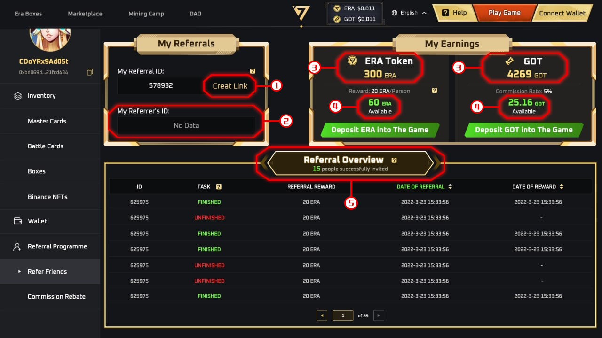
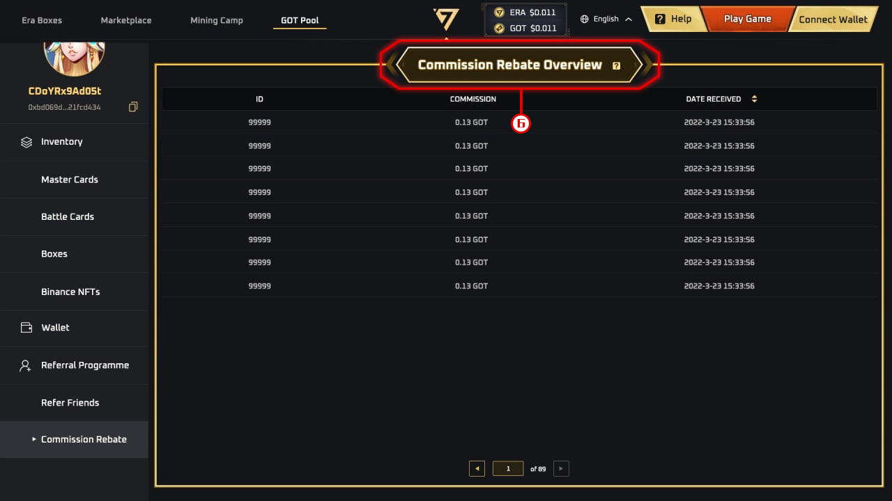

# Introduction to Referral+

## **-Who can join the program?**

It is only available to the players who have set up their Era7 accounts and connected their wallets to the game.

## **-Where can I find the Referral+ page?**

Visit Era7 MKP → Click on the profile icon → \[Referral+]

## **-How to use Referral+?**

Step 1: Visit \[Referral+] → Click on \[Create Link] in \[My Referrals] to get your referral link.

Step 2: Share your referral link with your friends to register their Era7 accounts.

Step 3: To complete your referral. First, your friends need to register their Era7 accounts via your referral link. After the registration, they will need to carry out the task: to claim Game GOT to their wallets.\
When this is done, you will be able to start earning the rewards.

## **-What is the Referral Rewards?**

You can get two kinds of rewards when your friends complete the task (registering an Era7 account and claiming Game GOT Token from the game.).\
ERA Token Reward: Get 20 ERA Tokens for every invited friend who completes the task.\
GOT Reward: Every time when your invited friend claims Game GOT to their wallet, you get a 5% commission based on the number of Game GOT they claim.

1\.    \[Create Link]

a.    Click on \[Create Link] and get your exclusive referral link.

b.    For now, you can only refer friends via this link. There will be more referral modes coming out in the future.

2\.    My Referrer’s ID\
Your friend’s Referral ID is displayed here if you registered your Era7 account via your friend’s referral link. If you do not have a referrer, No Data is displayed.

3\.    GOT/ERA Token

It shows the number of GOT/ERA Tokens you've earned and already collected from the Referral+.

4\.    Available GOT/ERA Token

a.    It shows the current GOT/ERA Tokens you can collect from the Referral+ program.

b.    Click on \[Deposit GOT/ERA Token into The Game] to collect your earnings from the Referral+ program.

c.    GOT/ERA Token + Available GOT/ERA Token = the total number of earnings from the Referral+ program.

5\.    Referral Overview

Here are the details of your referrals, whether your invited friends have finished the task, and the ERA Token reward from the Referral+ program.

6\.    Commission Rebate Overview

Here are the 5% commission details that you get every time your invited friends claim Game GOT.
