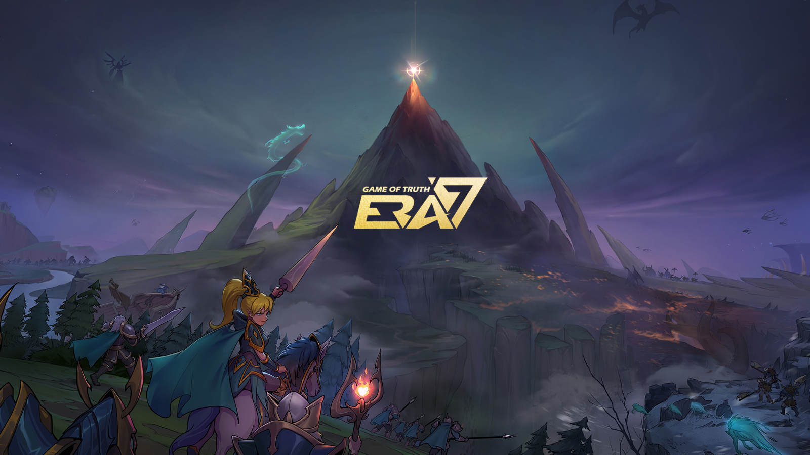

# The Game’s Background

* Era7: Game of Truth is a virtual world, built on Web3.0, that runs parallel to the real one. Functioning as a vast and traversable online world with monetary assets, social methods and complete spatial perception and physical rules, it’s not only independent of the real world, but complementary to it.&#x20;
* Era7 is a playable NFT card game, allowing players to experience the happiness and economic value enabled by GameFi with a very low threshold of entry.
* Era7's artistic inspiration comes from TCGs like Hearthstone and Magic: The Gathering.
* The Game of Truth plot revolves around seven races on the Continent of Truth who compete for the title of "King of Truth." Amongst the races are groups of specially gifted individuals who are sent to attend Summoner Academy to undergo rigorous training where they graduate to become Summoners. Upon graduation, they travel the world to make Summoning Pacts with the most powerful amongst the seven races, to establish strong allies in order to consolidate their power.
* Since ancient times, throughout the year, battles amongst the Summoners have been held in the heart of the Continent. These Summoning Battles attract Summoners from all over the world who battle for the "King of Truth" title. The winner is crowned King of the Continent, and he and his race are awarded the highest honors in the land.&#x20;

