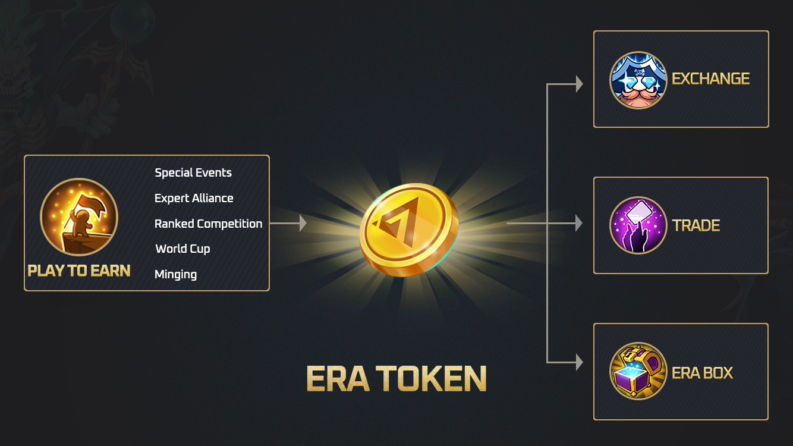
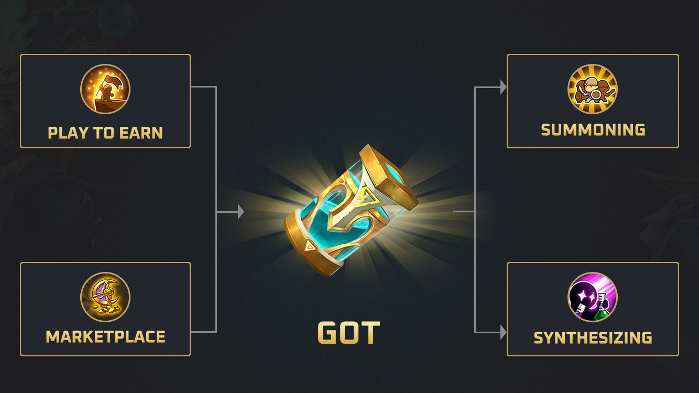
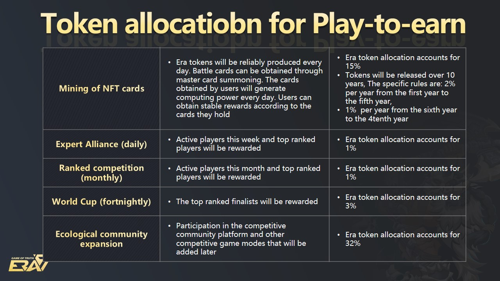
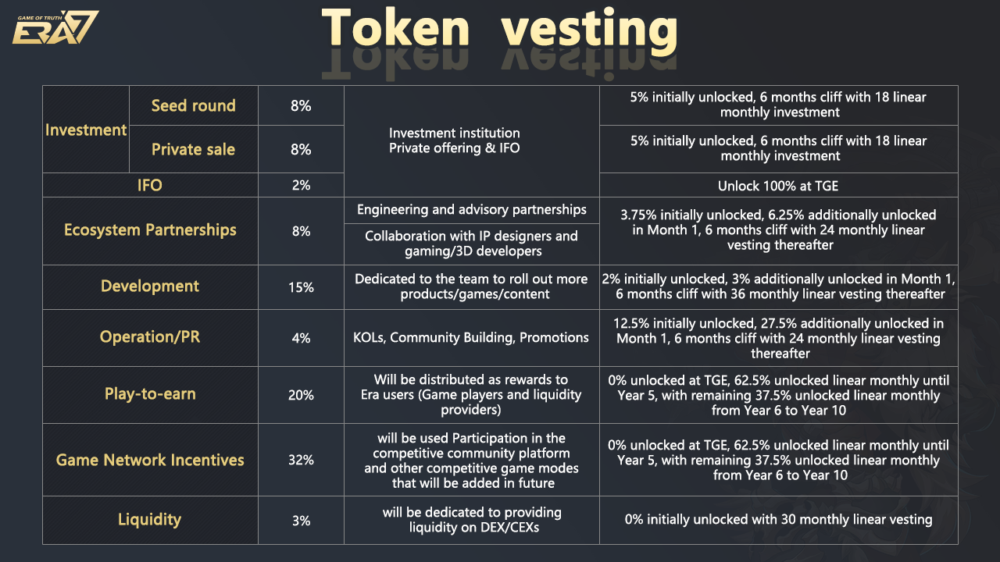

# Token economy

* The total amount of Era tokens to be issued is 1 billion. This is a token built by the Era7 Metaverse on the Binance Smart Chain (BSC), and currently serves exclusively as Era7’s platform token. Players can obtain Era token rewards through battling, getting involved in community incentives, and liquidity mining. With the development of the Era7 metaverse, the functions of Era tokens will extend to community governance, pledging and other rights and interests. The platform currency, the Era token, is effectively the Bitcoin of the entire Era7 metaverse. Era tokens are similar to stable tokens, and supply and demand are dictated by the market. The Era token obtained by the player can be exchanged for USDT or local fiat. Era tokens can also be purchased on other DEX\CEX platforms to summon new Era7cards.
* Main uses of the Era token:
  * To gain local currency via an exchange;&#x20;
  * To purchase GOT\master cards\battle cards\NFT items\NFT mystery boxes on the marketplace;
  * &#x20;To enable transactions between players (Era tokens may be used to trade Era7 cards, GOT or other in-game items);&#x20;
  * To purchase land and get more Era token rewards&#x20;
  * To issue a pledge for obtaining community rights, participating in governance, voting and subsequent decision-making;&#x20;
  * As a wager and/or as a registration fee for PVP.
* How to get Era tokens:&#x20;
  * Purchase them on DEX\CEX platforms;
  * Attain them via in-game rewards or air drops;&#x20;
  * Acquire them via liquidity mining.&#x20;
  * From PVP rewards.

* How to get GOT:&#x20;
  * From in game activities rewards&#x20;
  * From PVE rewards.

* Play to earn & Game Network Incentives – 52%
* The circulation of earned tokens will account for 52% of the total Era token supply.
* Of the 52% of tokens allocated through mining (play-to-earn), 20% will be used for ecological game incentives, including in-game behaviors that require NFT cards and the participation in various competitions set by the game. At the same time, 32% of the tokens will be used Participation in the competitive community platform and other competitive game modes that will be added in future. The Era7 project team will further develop the competitive ecological chain, launching an ace competitive product every year; the NFT of the Era token and the Era game will be universal to the platform.&#x20;
* Liquidity Mining – 3%&#x20;
* Game officials will be committed to providing liquidity on DEX / CEX.

.jpg>)

## Token vesting

* Development –  15%&#x20;
  * The Core team
* Ecosystem Partnerships – 8%&#x20;
  * Ecological partnerships include: engineering, advisory, IP designers, gaming and 3D development.
* Operation & Promotion – 4%&#x20;
  * KOLs, Competitors, Community Building, Promotions.
* Seed & Private rounds – 16%&#x20;
  * Private1 ,Private2 and institutional investors.
* IFO 2%

## Treasury

* In the future, the’Community Treasury‘will go live. This is effectively an entity that will receive revenue generated by Era 7 as well as a portion of wagering rewards. This treasury will eventually be governed by those who place wagers on the Game of Truth, once the network has become sufficiently decentralized.

