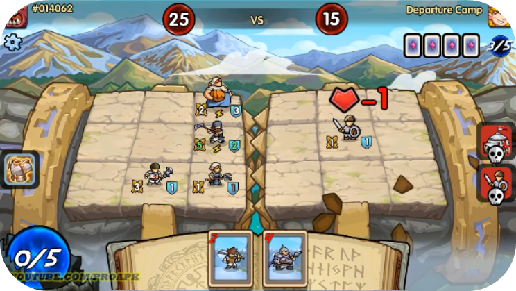

# Game Play

* We’re offering an NFT trading-card game inspired by Hearthstone and Magic: The Gathering. Standing on the shoulders of a Titan, there’s groundbreaking new gameplay to be had. Moreover, whilst this is a highly-competitive game, it is relatively stress-free and requires very little commitment, with games lasting just 3 minutes each.
* Era7’s cards are divided into battle cards and master cards for summoning. Various cards from various races increase the richness and playability of the game tenfold. Seven forces, with as many as 1,000 cards, give Era7 unlimited reach, territory in which to expand and incredible value as a game.
* It is this huge card system that shall give the game a fantastic variety – there will always be new heights for players to reach, and as a result, the chance of player burnout is zero.
* Moreover, the numerical system in the game is very balanced and the logic of the game’s design is very clear, which makes Era7’s battles rich and diverse while fair and competitive.
* With each battle lasting only three minutes, players are forced to think on their feet to form their own unique lineups through intensive strategic planning. No matter what the player's level is, they can have fun. Furthermore, for those that like to take risks, E-sports is a promising faculty that the game will provide as standard.


[Broken link](broken-reference)



[fighting-gameplay.md](fighting-gameplay.md)



[summoning.md](summoning.md)



[synthesizing.md](synthesizing.md)

